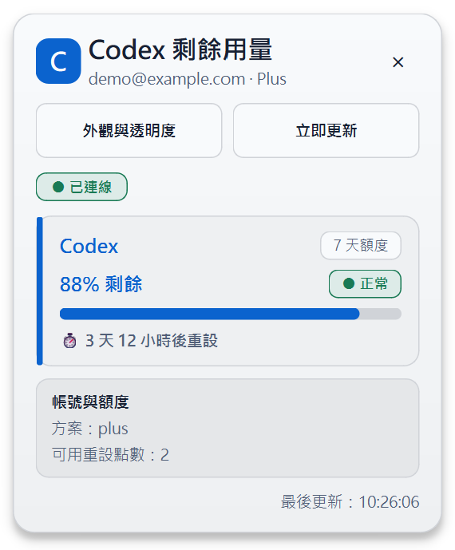

# Codex／Claude 剩餘用量小工具

[](https://www.python.org/)
[](#使用條件)
[](LICENSE)

這個專案包含兩個 Windows 10/11 x64 繁體中文浮動小工具：



- `CodexUsageWidget.exe` 透過本機 `codex app-server` 的
  `account/rateLimits/read` 顯示 ChatGPT Codex 用量。
- `ClaudeUsageWidget.exe` 透過 Claude Code 官方 status line 的 `rate_limits` 欄位，
  顯示 5 小時與 7 天訂閱用量。

## 功能

- 無標題列、永遠置頂、可拖曳的浮動卡片。
- 多限額桶與 primary/secondary 時間窗。
- Codex 固定同時保留 5 小時與 7 天額度區塊；每個百分比分別計算，不應互相相加。若
  app-server 暫時未提供其中一個時間窗，該列會顯示「等待資料」，而不會偽造百分比。
- ChatGPT 瀏覽器登入；憑證完全由 Codex CLI 管理。
- app-server 事件更新加上每 60 秒完整校正。
- 系統匣、單一執行個體與打包版 Windows 自動啟動。
- 淺色／深色、高 DPI、鍵盤操作及明確的正常／注意／緊迫文字狀態。

協定細節請參考 [OpenAI 官方 Codex App Server 文件](https://developers.openai.com/codex/app-server)
及 [Anthropic 官方 status line 文件](https://code.claude.com/docs/en/statusline)。

## 使用條件

- Windows 10 或 11 x64。
- Codex CLI 0.147.0 以上，且 `codex` 指令必須位於 `PATH`。
- Claude 小工具需要 Claude Code 2.1.80 以上、`claude` 位於 `PATH`，以及 Claude.ai
  Pro／Max 等會提供 `rate_limits` 的訂閱登入。API key 帳號不會提供這組訂閱用量欄位。
- 執行打包後的 EXE 不需要另外安裝 Python。

若電腦尚未登入 ChatGPT，小工具會顯示「使用 ChatGPT 登入」。登入頁由 Codex app-server
產生並在系統預設瀏覽器中開啟；本程式不讀取、不記錄也不傳送 OAuth token。

Claude 小工具也不讀取 `.credentials.json`。第一次執行時按「啟用 Claude 用量整合」，程式會在
Claude `settings.json` 加入本機 status line 擷取器，並先備份原設定。擷取器只保存
`rate_limits`、重設時間、模型顯示名稱、CLI 版本與擷取時間；不保存工作目錄、對話內容、
transcript 路徑或 token。啟用後重新啟動 Claude Code 並完成一次正常回應，即可看到用量。
若偵測到既有自訂 status line，程式會拒絕覆蓋並顯示提示。

## 開發環境

依專案規範，Windows 使用 Scoop 安裝 Python：

```powershell
scoop install python
python -m venv .venv
.\.venv\Scripts\python.exe -m pip install -r requirements.lock
.\.venv\Scripts\python.exe -m pip install -e . --no-deps --no-build-isolation
```

若目前的 PowerShell 仍解析到 Microsoft Store 的 Python 別名，請重新開啟終端，或直接使用
Scoop 顯示的 Python 安裝路徑建立 `.venv`。

常用指令：

```powershell
# 執行
.\.venv\Scripts\python.exe -m codex_usage_widget
.\.venv\Scripts\python.exe -m claude_usage_widget

# 測試
.\.venv\Scripts\python.exe -m pytest

# 靜態檢查與格式化
.\.venv\Scripts\python.exe -m ruff check .
.\.venv\Scripts\python.exe -m ruff format .

# 測試後打包單一 EXE
.\scripts\build.ps1
.\scripts\build-claude.ps1
```

建置結果位於 `dist\CodexUsageWidget.exe` 與 `dist\ClaudeUsageWidget.exe`。兩者都是未簽章的
可攜版程式，Windows SmartScreen 可能在第一次執行時顯示提示。

GitHub Actions 會在 Windows runner 執行格式檢查、靜態檢查、完整測試與兩個 EXE 的封裝，
並將可攜版程式保存為工作流程 artifact。貢獻方式請參考 [CONTRIBUTING.md](CONTRIBUTING.md)，
安全性回報方式請參考 [SECURITY.md](SECURITY.md)。

## 操作

- 拖曳卡片標頭可移動位置；位置會保存在目前 Windows 使用者的 Qt 設定中。
- Codex 主畫面的「外觀與透明度」按鈕會在剩餘用量介面內展開外觀調整列，可即時調整並保存
  35–100% 介面透明度，以及限額名稱、剩餘百分比、重設倒數與用量進度條的同步重點色；
  卡片背景仍跟隨 Windows 明暗模式。外觀面板的色彩示意不代表實際用量；「恢復預設」會清除
  自訂重點色並恢復 100% 透明度。
- Codex 的「立即更新」按鈕會直接重新查詢；Claude 的 `↻` 重新讀取 status line 快取與登入狀態。
- Claude Code 在執行期間會依官方 status line 的 `refreshInterval` 每 60 秒更新本機快取；
  Claude Code 關閉後，小工具會保留最後資料並標示等待下一次更新。
- `×` 將卡片隱藏到系統匣，而不會停止更新。
- 系統匣選單可顯示／隱藏、立即更新、切換登入 Windows 後自動啟動，或完全退出。
- 外觀調整列展開時，`Esc` 會先將它收合；其他情況下則將卡片縮到系統匣。

## 疑難排解

- **找不到 Codex CLI**：確認終端可執行 `codex --version`，並重新啟動小工具。
- **Codex CLI 過舊**：更新至 0.147.0 或以上。
- **目前是 API key 登入**：用量端點需要 Codex services 支援的 ChatGPT 身分；按卡片上的
  ChatGPT 登入按鈕。
- **資料暫時無法更新**：卡片會保留最後快照並標示可能過期，之後自動重試。
- **移動 EXE 後無法自動啟動**：手動啟動一次；若原本已啟用自動啟動，程式會修正登錄路徑。
- **Claude 一直顯示等待資料**：重新啟動 Claude Code，確認使用 Claude.ai 訂閱登入，並完成
  一次正常模型回應。官方 `rate_limits` 在第一個 API 回應前不會出現。
- **Claude 已有自訂 status line**：小工具不會覆蓋它。請先備份並停用既有 `statusLine`，再按
  「啟用 Claude 用量整合」。
- **Claude Code 關閉後資料變舊**：這是 status line 來源的限制；小工具不會讀取 OAuth token，
  也不會為了刷新而自行送出模型請求、消耗額度。

## 限制

第一版不含用量歷史、低用量通知、reset-credit 兌換、帳號登出／切換、自動更新、安裝程式
或程式碼簽章，也不支援 macOS、Linux、ARM64。Claude 用量來源依賴 Claude Code status line；
它不是 Anthropic 公開 REST API，因此只會在 Claude Code 正常工作時更新。
